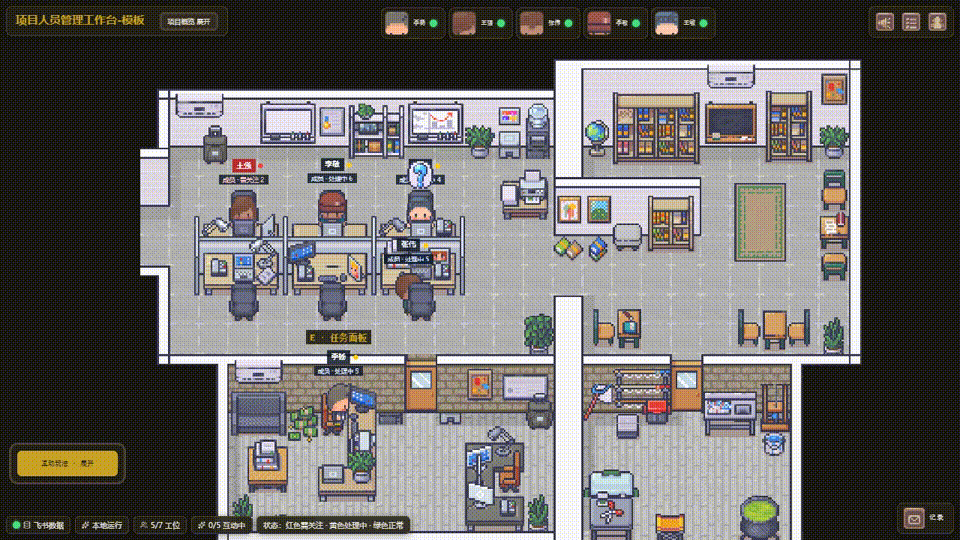

# Office Live 小剧场 🏢🎮

> 把**飞书多维表格**，在 **15 分钟**内变成一个本地运行的**像素办公室互动页面**（数据实时双向同步）。娱乐的同时管理团队，让紧张的工作多一份乐趣。

## 🎬 视频



<details>
<summary>下载视频文件 (mp4)</summary>

[office-live-demo-long.mp4](assets/office-live-demo-long.mp4)

</details>

---

## 这是什么

一个 **Agent Skill**：装进 coding agent 后，给定飞书多维表格，自动识别表里的人员与事项，生成一个像素风办公室互动页面——

- 🏢 成员在办公室工位走动、互动（数据来自飞书表格，实时同步）
- 👤 点成员查看工作旅程、任务与项目情况
- 🔄 管理员可调整任务负责人 / 新增任务（双向写回飞书）
- 🎮 互动玩法：专注、会议、休息、学习等场景动画，全员可玩
- 🔒 管理操作需口令（默认取表格名），员工只看不能改

**交付物** = 一个可运行的本地网页。用户仅需提供表格链接 + 回答几个确认问题 + 首次扫码授权。

---

## 安装（对 agent 说一句话即可）

把这个仓库地址给任意 coding agent，让它安装为 Skill：

```text
请把 GitHub 仓库 https://github.com/Yara918/office-live-doubao 安装为 Skill，然后按它的 SKILL.md 流程来用。
```

装好后，对它说"请读取我的「表格名」做成像素办公室小剧场"即可触发。

---

## 适配环境（前置条件）

| 环境项 | 要求 |
|---|---|
| **lark-cli** | 需已安装；首次生成未授权时输出飞书授权链接/二维码 |
| **飞书授权** | 首次生成时扫码同意；授权完成后验证状态并重跑同一条生成命令，之后自动续期、无需再授权 |
| **飞书多维表格** | 提供表格链接（可读即可生成；写回操作需编辑权限） |
| **Node.js + 页面模板** | 本 Skill 自带 `templates/page/`（完整 Next.js 项目） |

> 表格要求：飞书多维表格即可（表里含人员信息 + 事项信息即可生成），表结构、字段名不限，Skill 自动分析识别。
>
> 📌 **授权说明**：全程只需扫码一次（飞书表格读写权限，约 30 秒），之后不再需要。不需要安装任何软件、不需要手动搜索任何命令。

---

## 使用方法（触发话术）

> **方式一（给表格链接）**：
> "请读一下我的飞书多维表格：<表格链接>，帮我生成一个 Office Live 小剧场"
>
> （生成页面只需表格可读；如需在页面写回操作，当前授权账号必须对表格有编辑权限，且分享权限需允许编辑。全程不需要提供任何凭证/密钥，授权由 Skill 自动弹出扫码链接完成。）
>
> **方式二（按名称/关键词）**：
> "请读取我的「<表格名称>」表格，做成像素办公室互动小剧场"
>
> **方式三（简短指令）**：
> "把我的团队成员任务表，变成一个可以互动、还能管理任务的办公室页面"

### 对话示例（完整）

> **用户**：请读我的飞书表格：<链接>，生成一个 Office Live 小剧场
>
> **Agent**：已收到表格，我先做了数据梳理——
> 📊 共读取 3 张表、80 条记录；识别到可用于展示和互动的内容
> ⚠️ 注意到：部分记录缺少负责人或关键时间字段，页面会保留原字段并在详情中标出
>
> 我读到了 3 张表：**<表A>**（<字段1>/<字段2>/<字段3>）、**<表B>**（<字段1>/<字段2>）、**<表C>**（<字段1>/<字段2>）。全部表都会进入分析展示。开始前需要您确认几件事：
> **1. 主入口确认**（必答）：页面主入口表=「<表A>」？人员档案表=「<表B>」？项目表=「<表C>」？（有出入直接说改哪张；未选表仍会进入全量分析）
> **2. 请写出「事项名称」那一列的字段名**（必答）——哪一列代表"这条记录叫什么"，把列名原样写出来（如「事项名称」「标题」「编号」），完全按您写的列名使用。
> **3. 请写出「负责人」那一列的字段名**（必答）——哪一列代表"这条事项由谁负责"，把列名原样写出来（如「负责人」「经办人」「处理人」），完全按您写的列名使用。
> **4. 谁是表格管理员？**（必答，将作为小剧场管理员，可分配任务/调整负责人）
> **5. 人数确认**：当前 6 人，页面最多展示 8 人，确认继续生成？
>
> **补充说明（重要提醒）**：管理员操作需输入口令（默认「表格名」）；互动玩法、查看档案全员可用。📌 如需在页面写回（调整负责人/新增任务），当前授权账号必须对表格有编辑权限，且分享权限需允许编辑；仅查看与互动则无需。
>
> **用户**：1 主入口确认（<表A>/<表B>/<表C>），2 事项名称那列是「<字段名>」，3 负责人那列是「<字段名>」，4 我是管理员，5 确认（链接已设为可编辑）
>
> **Agent**：好的，开始生成，约 10-15 分钟后即可运行。

> 完整示例见 [examples/conversation-example.md](examples/conversation-example.md)

---

## 注意事项

- **本地运行**：页面运行在 agent 环境，默认优先使用 `http://localhost:3000`；如端口被占用，按 `deliver.mjs` 输出的新端口访问。不部署到外部平台；每次使用需启动页面（`npm run dev` / `npm start`）。
- **表格权限**：生成只需可读；写回操作（调整负责人/新增任务）要求表格分享权限为**「互联网上获得链接的人可编辑」**——未开启或仅「可阅读」时一律只读（谁都不例外）。
- **人数限制**：页面最多展示 **8 人（含管理员）**，超过 8 人成员不显示（针对 8 人以内小团队最适配）
- **管理口令**：默认取表格名称；管理员操作（调整负责人/新增任务）需口令，员工只读
- **适用表**：各类客户 Base 都会全量分析展示；其中带有明确“人 + 事”字段的表，可作为页面主入口支持工位聚合、负责人调整和新增事项写回
- **数据体量**：建议 500 条以内，这个范围内页面加载和实时同步最流畅；数千条的大表（如进销存/工单系统）更建议在飞书原表里管理
- **敏感信息**：Skill 全文不含真实人名/公司名/密钥；交付不暴露代码与配置
- **合规**：文档用占位符（`<管理员姓名>` `<表格名>`），不出现可识别个人信息
- **全量分析**：页面主入口表只决定工位与写回入口，Base 内其他表仍进入全量概览、人员旅程和详情展示

## 模型与运行环境提示

- **交付是一次到底的链路**：读表 → 确认 → 生成 → 安装依赖 → 启动服务 → 验证首页/快照 → 写回验证，应连续完成，不要停在中间步骤（如“装依赖中/待起服务/待验证”）。
- **部分模型或 Agent 框架可能在长耗时步骤中断**：例如 `npm install` 需要数分钟，个别模型会把它误当成“任务结束”提前收尾。这是模型行为，不是 skill 故障。
- **如果中断了，怎么继续**：
  1. **先在当前对话里继续，不要急着换模型**——直接对当前 agent 说“继续 / 接着跑完”，它会重跑同一条 `deliver.mjs` 命令续上（配置已生成，重跑会快速补完剩余步骤，不用从零开始）。
  2. 只有当前对话反复失败、agent 明确无法继续时，才考虑换一个**具备完整工具调用、能持续长任务**的模型（如能力更完整的 Coding / Agent 模型）。
- **首次运行耗时长是正常的**：读表 + 生成 + npm install 装依赖 + 启动 + 验证，全程数分钟属预期；不要因为“慢”就误判失败而换模型或中断。

---

## 目录结构

```
office-live/
├── SKILL.md            # 主指令（Agent 加载）
├── README.md           # 本文件（对外介绍）
├── RULES.md            # 交付规则与边界
├── references/         # 详细流程文档（按需加载）
│   ├── delivery-flow.md    # 交付流程详解（数据分析/话术/确认）
│   ├── config-guide.md     # 配置生成指南
│   ├── deployment.md       # 本地启动指南
│   └── faq.md              # 常见问题
├── scripts/            # 辅助脚本
├── templates/          # 页面模板 / 配置示例
├── examples/           # 示例文件
└── assets/             # 截图等资源
```

---

## License

© 2026 保留所有权利（All Rights Reserved）。本作品仅供参赛演示使用，未经授权不得复制、分发或用于商业用途。
